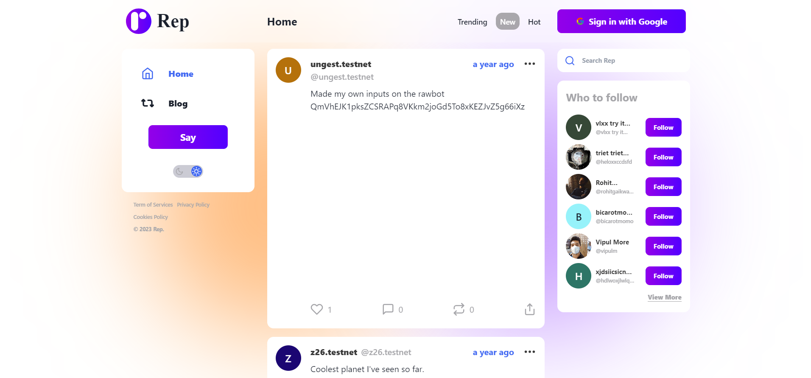
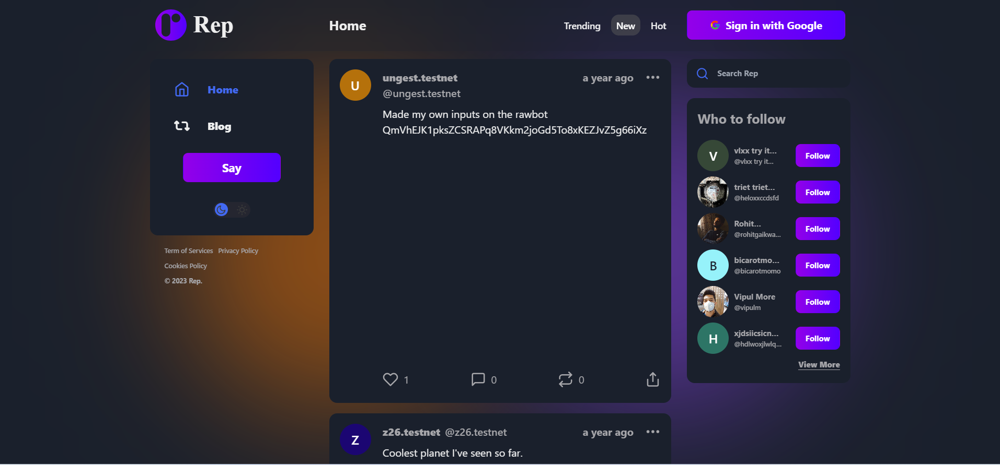
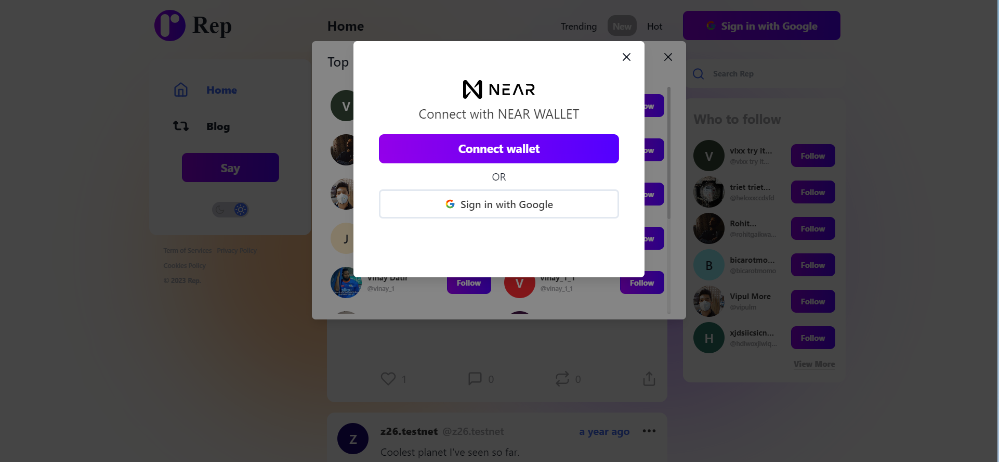
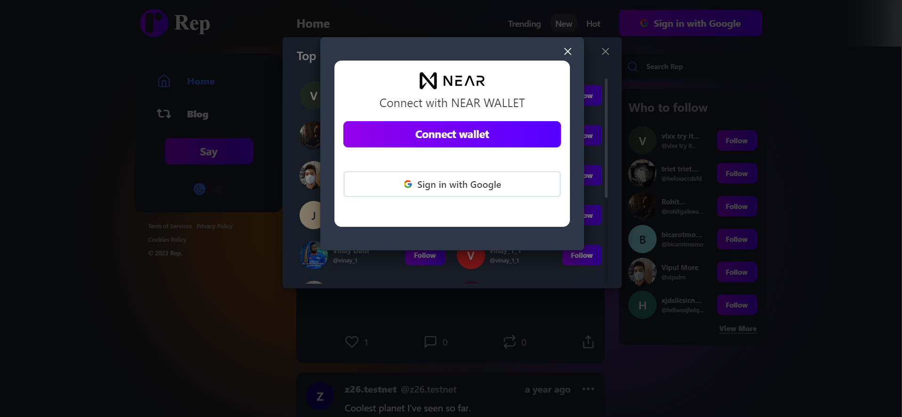
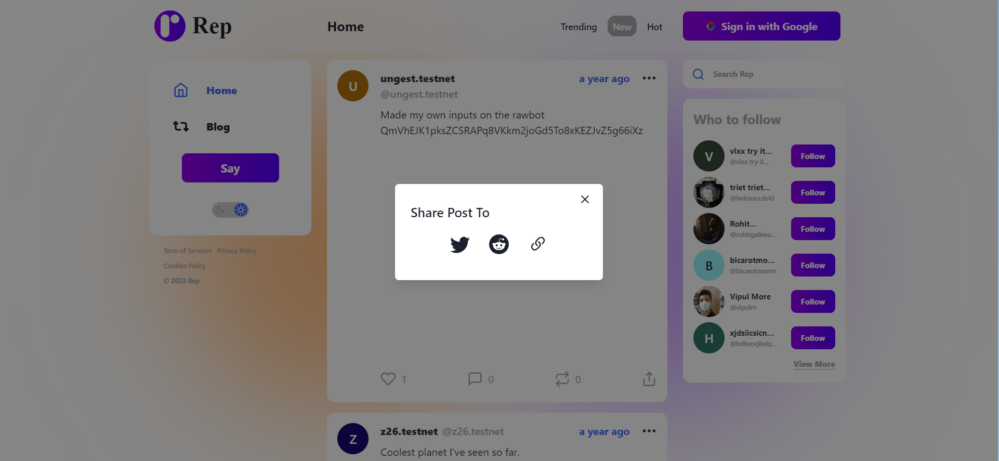
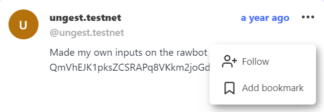
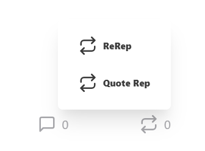

# rep_run_home
A repository stores the source code implemented for rep.run/ home ui

## Connect to NEAR WALLET
This requirement can be seen when you click on the "Conenct Near Wallet" button on a dialog opened when clicking on button __Say__, __Follow__ and 4 small buttons in 2 popover menu

## getPost function
This requirement is included in the UI, it is used to get the list posts to show in file `post_list.jsx`

## Implement UI
__The big white space is the image, don't know why all 2 given image urls cannot be loaded (also tested on the origin website)__
### Home
- 
### Home dark
- 
### Home with follow and sign in modal
- 
### Home dark with follow and sign in modal
- 
### Home with share post modal (also have dark mode but there are so much images now)
- 
### Post's top menu and repost menu (also have dark mode but there are so much images now)
-  